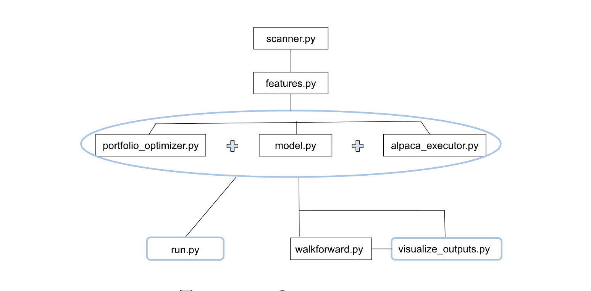
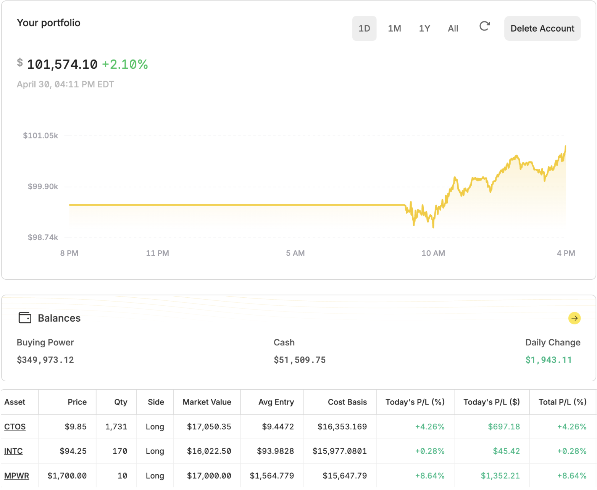
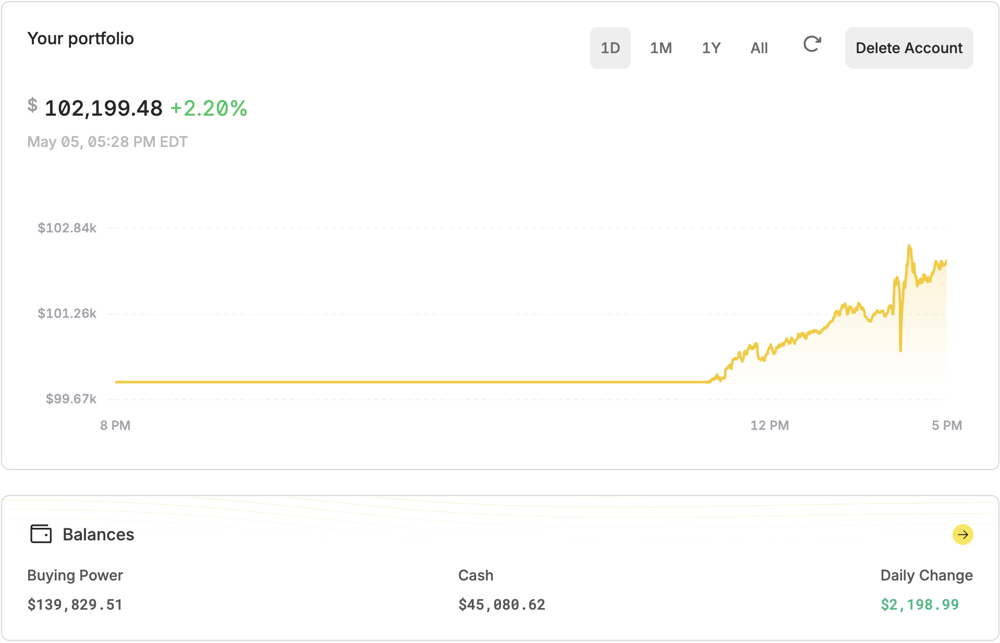
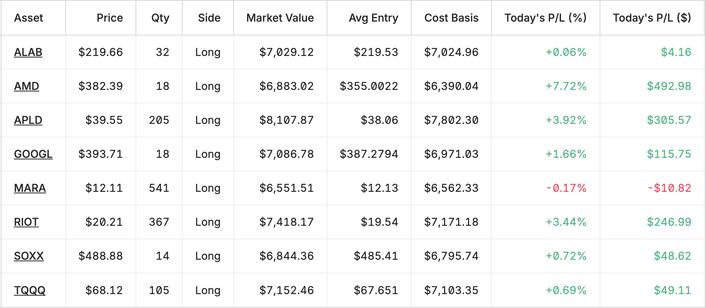
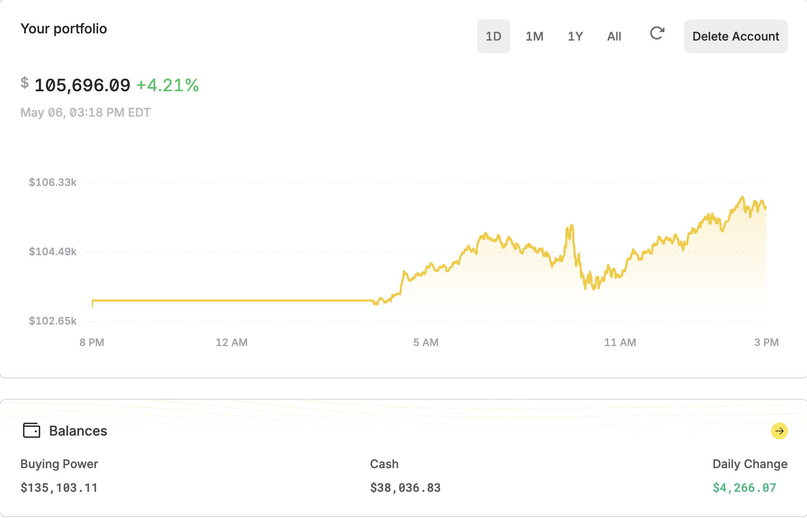
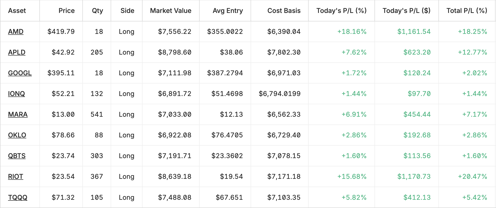
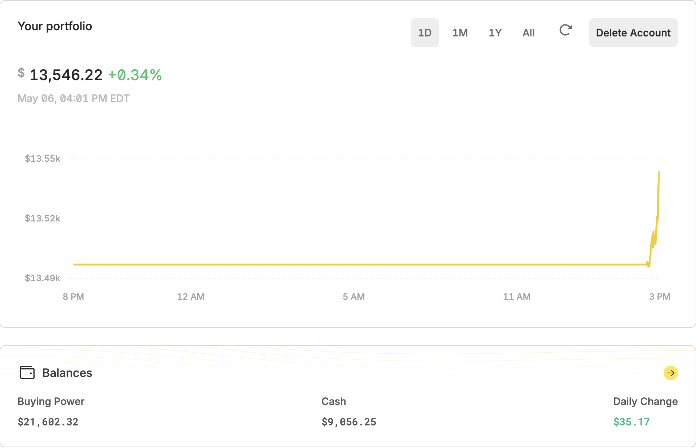
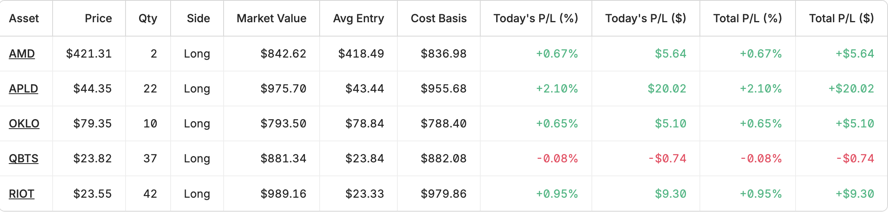
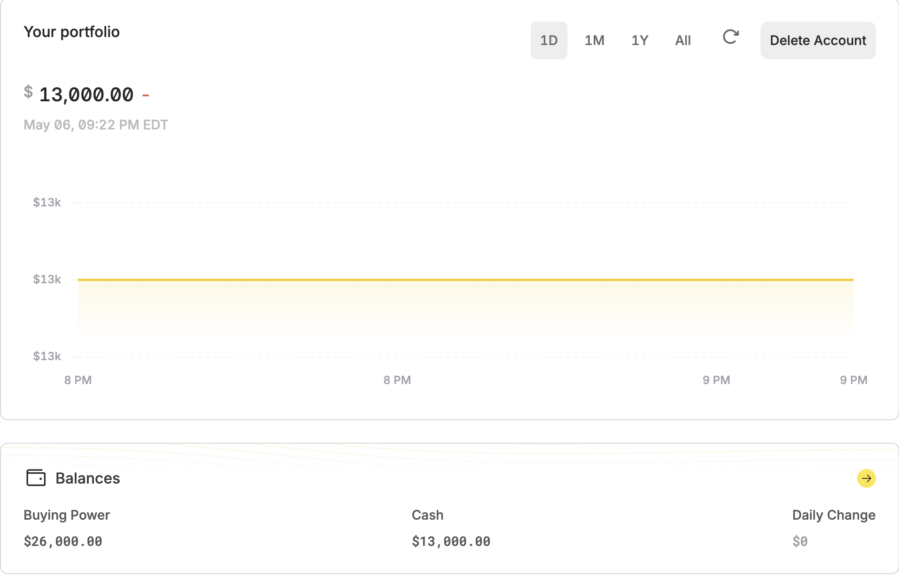

# Quantitative Reinforcement Learning Trading System

### Institutional-Grade Adaptive Trading Framework

---

## Overview

This repository showcases a **production-grade quantitative trading system** designed to identify and execute high-conviction market opportunities using **reinforcement learning, statistical modeling, and dynamic portfolio optimization**.

This system integrates **data ingestion, feature engineering, machine learning, portfolio optimization, and execution** into a unified pipeline powered by the Alpaca API. Visit <a href="https://alpaca.markets/algotrading">alpaca.markets/algotrading</a> for a free account.

Built to operate in live market conditions with a strong emphasis on:

* **Capital preservation**
* **Risk-adjusted return maximization**
* **Adaptive behavior across market regimes**

> ⚠️ Note: This repository is a **sanitized portfolio version**. Core proprietary models, signals, and execution logic have been abstracted to protect intellectual property.

---

## Key Capabilities

### 📈 Adaptive Market Regime Awareness

* Dynamically classifies market conditions (e.g., bullish, bearish, transitional)
* Adjusts exposure and aggressiveness based on regime confidence
* Reduces drawdowns during unfavorable conditions

---

### 🧠 Reinforcement Learning–Driven Decision Engine

* Learns optimal position sizing and allocation policies
* Rewards high-conviction, high-return trades
* Penalizes stagnation, volatility drag, and drawdowns

---

### ⚖️ Portfolio Optimization Layer

* Post-decision optimization for **maximum Sharpe ratio**
* Dynamic capital allocation across active positions
* Risk-aware rebalancing under constraints

---

### 🛡️ Multi-Layer Risk Management

* Hard capital protection thresholds
* Dynamic exposure scaling based on equity state
* Position caps and liquidity-aware sizing
* Automatic drawdown mitigation protocols

---

### ⚡ Execution Engine

* Designed for real-time trading via Alpaca's Trade API
* Handles:

  * Order generation
  * Position reconciliation
  * Cash management
  * Trade journaling

---

##  System Architecture

<!-- markdownlint-disable MD033 -->
<!-- Image carousel / gallery (README-friendly) -->

  

<!-- markdownlint-enable MD033 -->

---

## Performance Philosophy

The system is designed around the following principles:

* **Exploit momentum and continuation asymmetry**
* **Let winners run, cut losers quickly**
* **Maximize return per unit of risk (Sharpe)**
* **Minimize capital erosion during uncertainty**
* **Adapt faster than static strategies**

---

## Features (Sanitized)

The system utilizes a diverse set of engineered signals, including:

* Trend and momentum indicators
* Volatility and dispersion measures
* Volume and liquidity metrics
* Relative strength and cross-asset relationships
* Market structure and regime indicators

> Specific feature formulations and transformations are proprietary and not included.

---

## Risk Management Framework

The system enforces a strict capital protection model:

| Equity State | Behavior                  |
| ------------ | ------------------------- |
| Normal       | Full strategy deployment  |
| Scaling      | Controlled expansion      |
| Recovery     | Reduced risk exposure     |
| Defensive    | Capital preservation mode |
| Kill Switch  | Full liquidation and halt |

Additional safeguards:

* No negative cash exposure
* Position concentration limits
* Volatility-aware sizing
* Dynamic de-risking under stress

---

## Backtesting & Validation

* Walk-forward validation across multiple time windows
* Out-of-sample evaluation for robustness
* Emphasis on:

  * Sharpe ratio
  * Maximum drawdown
  * Consistency of returns

> Historical performance results are available upon request.

---

## 💰 Results

### Day 1:

This system was able to produce more than $1,000 on its first day of trading.
<!-- markdownlint-disable MD033 -->
<!-- Image carousel / gallery (README-friendly) -->

  

<!-- markdownlint-enable MD033 -->

---

### Day 2:

I had to reset to a fresh account ($100,000) since I was developing this on an account associated with a different trading system. Despite this I was still was able to make well over $2,000 today. (Not a fluke)

<!-- markdownlint-disable MD033 -->
<!-- Image carousel / gallery (README-friendly) -->

  

<!-- markdownlint-enable MD033 -->
<!-- Image carousel / gallery (README-friendly) -->

  

<!-- markdownlint-enable MD033 -->

The system appears capable of identifying favorable trade opportunities while also demonstrating an ability to manage risk by cutting losses when conditions deteriorate. These observations are only preliminary and will require further validation across broader market conditions and longer evaluation periods.
  

---

### Day 3:

The system continued to let winning trades develop and scaled deeper into runners while mitigating bad trades. No concerning results as of yet.

<!-- markdownlint-disable MD033 -->
<!-- Image carousel / gallery (README-friendly) -->

  

<!-- markdownlint-enable MD033 -->
<!-- Image carousel / gallery (README-friendly) -->

  

<!-- markdownlint-enable MD033 -->

>**UPDATE** 
I was able to secure capital for a live alpaca account with $13,000 as the initial investment. I redeveloped the program to paper trade with 13k instead of 100k. My plan is to paper trade the 13k for now to ensure the system will work as expected despite the reduced portfolio equity.

I’ve set up the 13k account for live trading.

<!-- markdownlint-disable MD033 -->
<!-- Image carousel / gallery (README-friendly) -->

  

<!-- markdownlint-enable MD033 --><!-- Image carousel / gallery (README-friendly) -->

  

<!-- markdownlint-enable MD033 -->

Despite this run being considerably less impressive than the rest due to the drastically reduced portfolio equity, results still prove to be favorable with the model consistently predicting positive momentum in stock price. I should also mention **this iteration only traded for about 30 minutes** before markets closed today.

I decided to start fresh and reset the account equity back to $13,000 for tomorrow’s session.

<!-- markdownlint-disable MD033 -->
<!-- Image carousel / gallery (README-friendly) -->

  

<!-- markdownlint-enable MD033 -->

---

## Production Considerations

The live system includes:

* Automated trading universe selection
* Automated monitoring and order execution
* Automatic portfolio rebalancing
* Automated capital preservation & risk management
* Fault-tolerant data pipelines
* Real-time logging and monitoring
* Persistent trade journal and equity tracking

---

## Use Cases

This system is designed for:

* Proprietary trading strategies
* Quantitative research and experimentation
* Portfolio management automation
* Institutional or private capital deployment

---

## Intellectual Property Notice

This repository intentionally omits:

* Proprietary model weights
* Exact feature engineering logic
* Live execution strategies
* Parameter configurations

All core alpha-generating components remain private.

---

## Roadmap

* Enhanced regime classification models
* Advanced execution optimization
* Sentiment analysis
* Integration with additional data sources
* Mobile app dashboard

---

## Contact

For collaboration, investment inquiries, or technical discussion:

* Email: [blkpvnthr@asmaa.dev](mailto:blkpvnthr@asmaa.dev)
* GitHub: [github.com/blkpvnthr](https://github.com/blkpvnthr)

---

## Summary

This system represents a **fully integrated, adaptive trading framework** combining machine learning, quantitative finance, and robust engineering practices.

It is designed not just to perform—but to **survive, adapt, and scale** in real market environments.

---

>**DISCLAIMER** 
> This project is for informational and research purposes only and does not constitute financial advice or an offer to manage capital. Trading involves risk, including potential loss of principal.